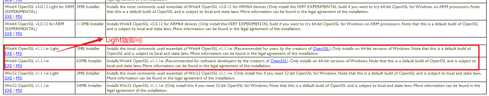
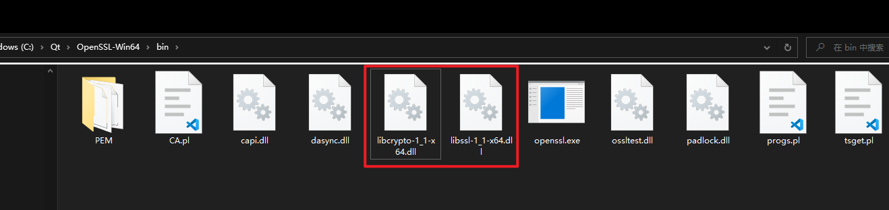

# [OpenSSL不支持问题](./)   

>#### 参考内容   
>
>-  [Qt Https通信：TLS initialization failed 解决方法](https://blog.csdn.net/lizaijinsheng/article/details/131699928)     
>- [The Win32/Win64 OpenSSL Installation](https://slproweb.com/products/Win32OpenSSL.html)     

## 1 支持版本   

打印OpenSSL是否支持，并获取支持的版本。

```c++
	
    qDebug()<< QSslSocket::sslLibraryBuildVersionString();
    //获取 Qt 所支持的版本
    qDebug() << "OpenSSL支持情况:" << QSslSocket::supportsSsl();//若输出：OpenSSL支持情况: false，那说明当前 Qt 不支持 OpenSSL

"OpenSSL 1.1.1g  21 Apr 2020"
 OpenSSL支持情况: false
```


## 2 下载OpenSSL  

[The Win32/Win64 OpenSSL Installation](https://slproweb.com/products/Win32OpenSSL.html)      



- 下载下来后直接安装  [Win64OpenSSL_Light-1_1_1w.exe](..\..\Downloads\Win64OpenSSL_Light-1_1_1w.exe)  
- 拷贝 [libcrypto-1_1-x64.dll](OpenSSL\)和 [libssl-1_1-x64.dll](OpenSSL\)  →  Qt的bin目录下 C:\Qt\5.15.2\mingw81_64\bin 和 C:\Qt\5.15.2\msvc2019_64\bin   



## 3 检查是否成功  

再次运行即可。


